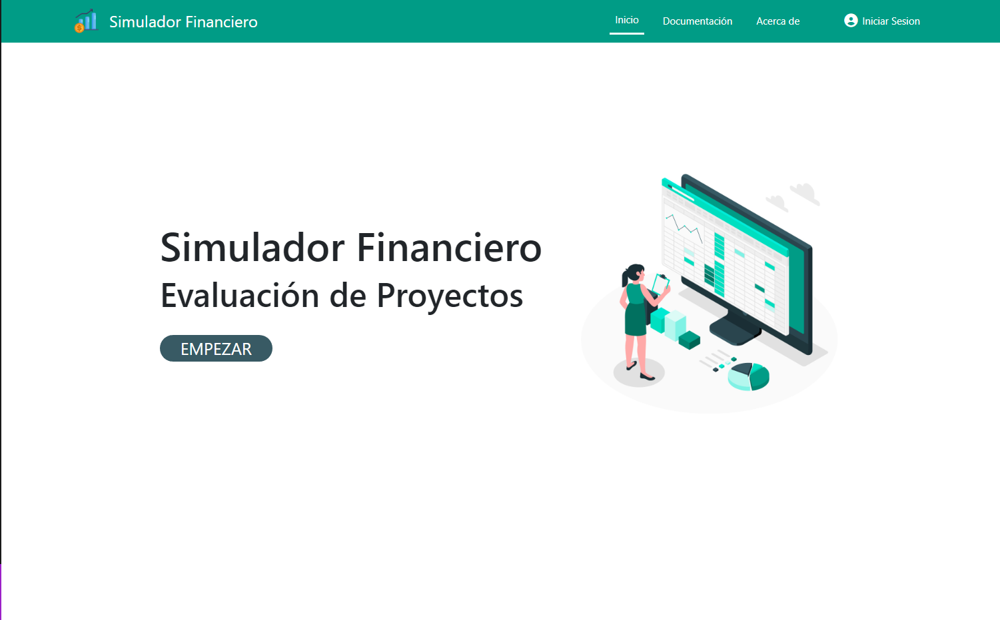
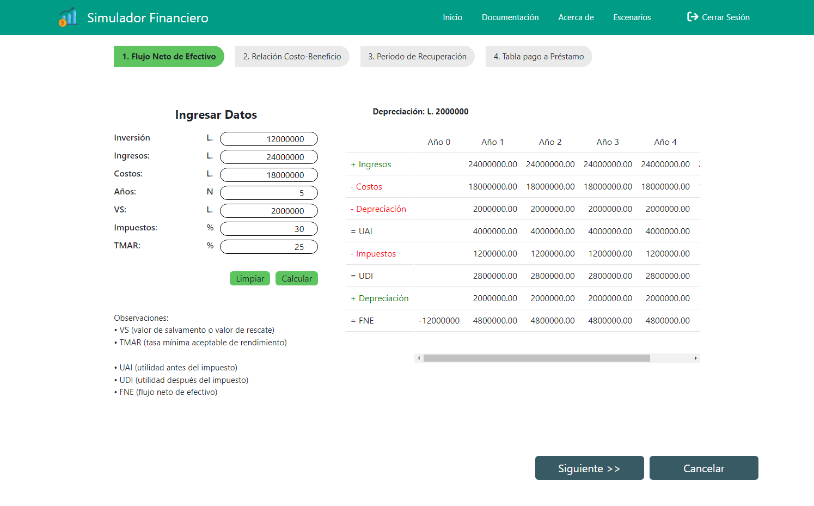
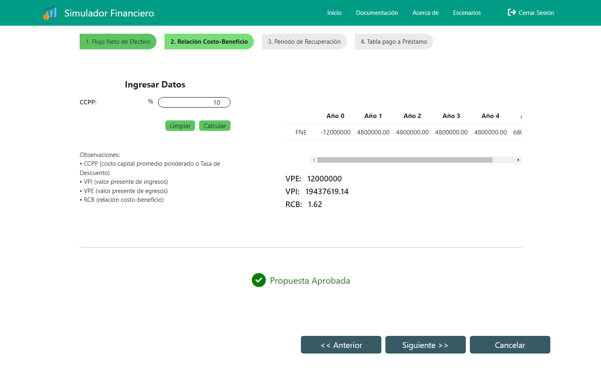
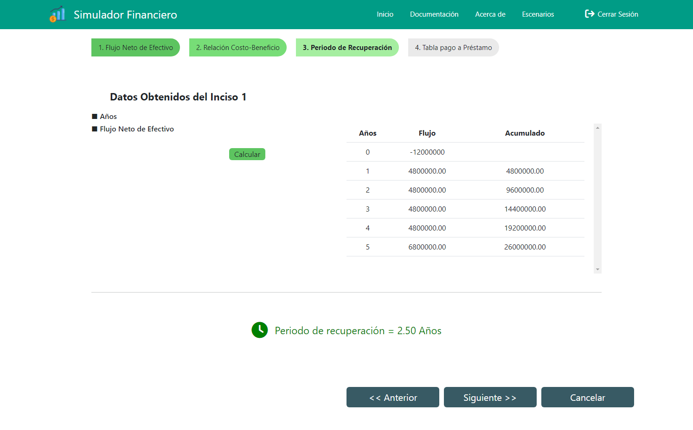
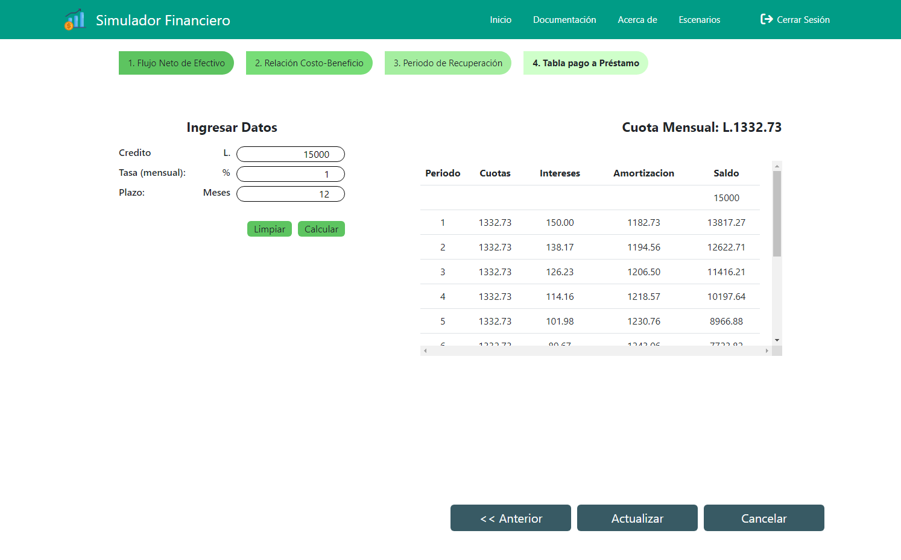

# SimuladorFinanciero-Frontend

Frontend - Proyecto de la clase Teoría de la Simulación.

 

## Requisitos (Instalar)

<li> Node.Js
<li> Angular

 

## Comandos

<table>
  </tr>
    <td>
      npm install
    </td>
    <td>
      Instalar dependencias de Node.
    </td>
  <tr>
  <tr>
    <td>
    npm run dev
    </td>
    <td>
    Inicia el servidor de desarrollo de angular.
    </td>
  </tr>
</table>
 

## Tecnologías y Herramientas.

 

## Capturas de Pantalla.

